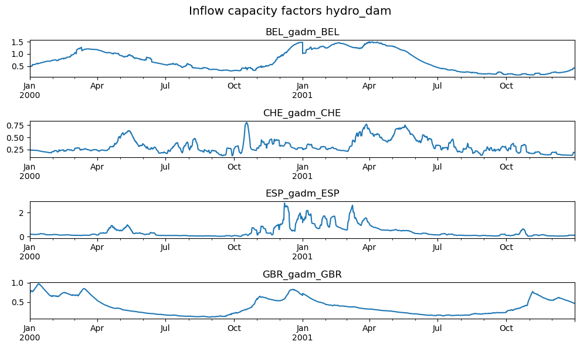

# clio - Hydropower module

A module to calculate hydropower inflow timeseries for facilities around the globe. Based on Euro-Calliope methods.



A modular `snakemake` workflow built for [`clio`](https://clio.readthedocs.io/) data modules.

## Steps

1. [HydroBasins](https://www.hydrosheds.org/) data is downloaded and combined into a global dataset.
2. Powerplant positions are geo-corrected to the nearest basin, and then assigned to the nearest shape.
3. Inflow in cubic meters is obtained for each powerplant location using ERA5 data through the [`atlite`](https://github.com/PyPSA/atlite) library.
4. Inflow in MWh is obtained for each plant using the given historical national annual hydropower generation and its share of total installed national capacity.

> [!IMPORTANT]
> The module assumes that provided sample of powerplants sums up to the total national capacity in the given year.
> Providing incomplete data might lead to distortions in the calculated time series!

## Using this module

This module can be imported directly into any `snakemake` workflow.
Please consult the integration example in `tests/integration/Snakefile` for more information.

## Development

We use [`pixi`](https://pixi.sh/) as our package manager for development.
Once installed, run the following to clone this repo and install all dependencies.

```shell
git clone git@github.com:calliope-project/module_hydropower.git
cd module_hydropower
pixi install --all
```

For testing, simply run:

```shell
pixi run test
```

To view the documentation locally, use:

```shell
pixi run serve-docs
```

To test a minimal example of a workflow using this module:

```shell
pixi shell    # activate this project's environment
cd tests/integration/  # navigate to the integration example
snakemake --use-conda  # run the workflow!
```
